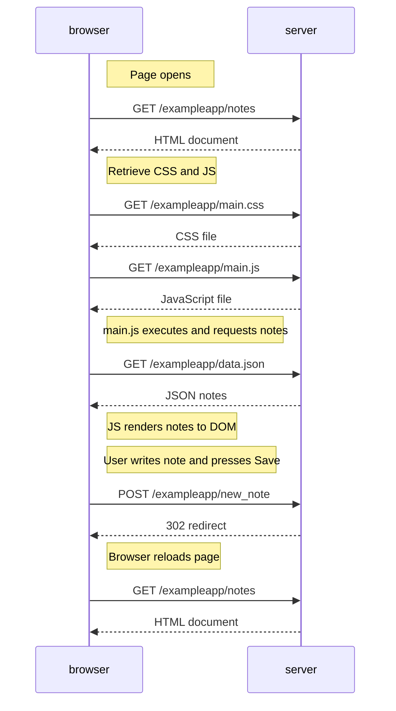

```mermaid
sequenceDiagram
participant browser
participant server

Note right of browser: Page opens
browser->>server: GET /exampleapp/notes
server-->>browser: HTML document

Note right of browser: Retrieve CSS and JS
browser->>server: GET /exampleapp/main.css
server-->>browser: CSS file

browser->>server: GET /exampleapp/main.js
server-->>browser: JavaScript file

Note right of browser: main.js executes and requests notes
browser->>server: GET /exampleapp/data.json
server-->>browser: JSON notes

Note right of browser: JS renders notes to DOM

Note right of browser: User writes note and presses Save
browser->>server: POST /exampleapp/new_note
server-->>browser: 302 redirect

Note right of browser: Browser reloads page
browser->>server: GET /exampleapp/notes
server-->>browser: HTML document
```
