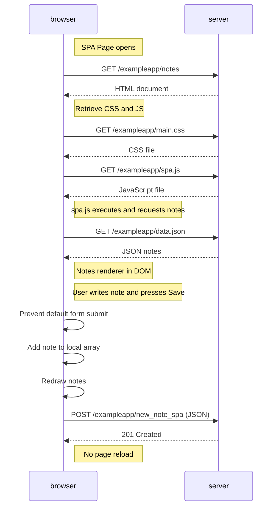

```mermaid
sequenceDiagram
participant browser
participant server

Note right of browser: SPA Page opens
browser->>server: GET /exampleapp/notes
server-->>browser: HTML document

Note right of browser: Retrieve CSS and JS
browser->>server: GET /exampleapp/main.css
server-->>browser: CSS file

browser->>server: GET /exampleapp/spa.js
server-->>browser: JavaScript file

Note right of browser: spa.js executes and requests notes
browser->>server: GET /exampleapp/data.json
server-->>browser: JSON notes

Note right of browser: Notes renderer in DOM

Note right of browser: User writes note and presses Save
browser->>browser: Prevent default form submit
browser->>browser: Add note to local array
browser->>browser: Redraw notes

browser->>server: POST /exampleapp/new_note_spa (JSON)
server-->>browser: 201 Created

Note right of browser: No page reload
```
